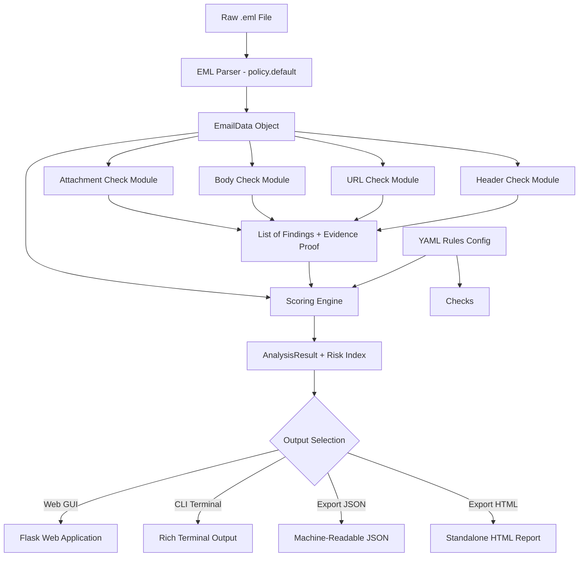

# Phishing Email Analyzer

An interactive, defensive cybersecurity application built in Python that performs static, offline risk assessments of raw `.eml` email files. It combines an automated scoring engine with a Web GUI specifically designed for phishing awareness training, security triage, and educational demonstration.

---


---

## Overview

Phishing remains one of the primary initial attack vectors in cybersecurity incidents. While security gateways block standard spam, developing human awareness and technical triage skills is essential for identifying sophisticated attacks.

The **Phishing Email Analyzer** parses raw email files (`.eml`) and transforms technical header, body, and attachment data into plain-language findings with direct evidence proof. It serves as both an automated security analyzer and an interactive training tool for students, IT professionals, and security analysts.

---

## Key Features

- **Static & Offline Analysis**: Operates completely offline with zero external network requests or active code execution.
- **Defanged Indicators**: Automatically defangs all URLs (`hxxp://`), domain names (`[.]`), and email addresses (`[at]`) in reports and UI outputs.
- **Interactive Web Dashboard**: Modern Flask web application featuring dual sample lists (Real-World Phishing Corpus vs. Synthetic Test Suite) ordered by Risk Index.
- **Explainable Risk Scoring**: Aggregates findings into a 0–100 weighted Risk Index with clear security verdicts (`Likely Legitimate`, `Suspicious`, `Likely Phishing`).
- **Direct Evidence Proof**: Displays exact email snippets, header values, and URL mismatches that triggered each security alert.
- **Multiple Output Formats**: Supports interactive Web GUI, rich CLI terminal tables, machine-readable JSON export, and standalone HTML reports.

---

## Educational & Training Use Case

This tool is designed to support phishing awareness education and technical training:

1. **Understanding Attacker Evasion**: Demonstrates how attackers use display-name spoofing, `From` vs. `Reply-To` mismatches, brand typosquatting, and link text tricks.
2. **Safe Inspection Practices**: Teaches users how to safely analyze raw headers, links, and attachment hashes without opening live links or executing files.
3. **Transparent Risk Evaluation**: Shows how individual indicators contribute to an overall risk score, helping analysts build intuition for threat severity.

---

## Screenshots & Visual Demonstration

### 1. Security Dashboard

*The Web GUI presents samples categorized into real-world and synthetic corpora, sorted top-to-bottom by risk score.*

---

### 2. Evidence-Backed Findings

*Each finding includes the exact snippet or header value extracted from the email as proof of suspicious activity.*

---

### 3. Command Line Interface

*Command-line interface providing color-coded risk summaries and defanged Indicators of Compromise (IOCs).*

---

## Security Indicators Explained

Below is an overview of the security checks performed by the analyzer, serving as a reference guide for identifying suspicious emails.

### 1. Header & Envelope Anomalies
- **Authentication Failures**: Checks SPF, DKIM, and DMARC verification results.
- **Address Mismatches**: Detects discrepancies between `From`, `Reply-To`, and `Return-Path` headers.
- **Display Name Spoofing**: Identifies display names that mimic internal roles or trusted brands while using unrelated email addresses.

### 2. URL & Link Evasion Tactics
- **Link Text vs. Destination Mismatch**: Identifies links where visual text displays one domain (e.g., `paypal.com`) while the `href` attribute routes to an unrelated site.
- **Brand Typosquatting**: Calculates Levenshtein distance to detect lookalike domains targeting major brands.
- **Punycode / IDN Homographs**: Flags internationalized domain names using lookalike characters to deceive users.
- **URL Shorteners & Raw IPs**: Identifies shorteners (`bit.ly`, `tinyurl.com`) or direct IP address URLs used to hide final destinations.
- **Suspicious TLDs**: Flags links resolving to high-risk top-level domains.

### 3. Social Engineering & Body Indicators
- **Urgency & Threat Language**: Detects pressure tactics demanding immediate action within short timeframes.
- **Credential & Payment Requests**: Identifies solicitations for passwords, payment updates, or sensitive verification data.
- **Embedded Forms**: Flags HTML emails containing password input forms or action endpoints.
- **Hidden Text Tricks**: Identifies CSS techniques (such as zero-font size or matching font/background colors) used to bypass filters.

### 4. Attachment Security
- **Dangerous File Extensions**: Identifies executable formats (`.exe`, `.scr`, `.bat`, `.ps1`, `.vbs`, `.js`, `.iso`, `.docm`, `.xlsm`).
- **Double Extensions**: Detects evasive naming conventions such as `invoice.pdf.exe`.
- **MIME Type Mismatches**: Compares declared MIME content types against actual file extensions.
- **Static Hash Extraction**: Computes SHA-256 hashes for safe IOC lookups without file execution.

---

## Sample Email Corpora

The application includes pre-loaded sample emails categorized for testing and demonstration:

| Corpus | Sample Count | Score Range | Description |
| :--- | :---: | :---: | :--- |
| **Real-World Phishing** | 6 | 65.0 - 100.0 | Real phishing emails sourced from public repositories (bank point phish, Microsoft security alert, imposter services). **Zero attachments.** |
| **Synthetic Test Suite** | 11 | 0.0 - 100.0 | Controlled test cases covering clean internal messages, marketing updates, softfails, typosquatting, credential harvesting, and dangerous attachments. |

---

## Architecture & Data Flow



---

## Installation

```bash
# Clone repository
git clone https://github.com/oponder2000/phishing-analyzer.git
cd phishing_analyzer

# Install package in editable mode with development dependencies
python -m pip install -e .[dev]
```

---

## Usage

### 1. Launch Web GUI
Start the local web interface:
```bash
phishing-analyzer gui
```

### 2. Command Line Interface

#### Analyze Single File
```bash
# Terminal output (default)
phishing-analyzer analyze samples/phish_cred_harvest.eml

# Export standalone HTML report
phishing-analyzer analyze samples/phish_cred_harvest.eml --format html --output report.html

# Machine-readable JSON output
phishing-analyzer analyze samples/phish_cred_harvest.eml --format json
```

#### Batch Analyze Directory
```bash
phishing-analyzer batch samples/
```

---

## Testing & Verification

Run the test suite using `pytest`:

```bash
pytest --cov=phishing_analyzer
```

**Test Status:** 30 passed | 88% Code Coverage

---

## License

Distributed under the MIT License. See `LICENSE` for details.
